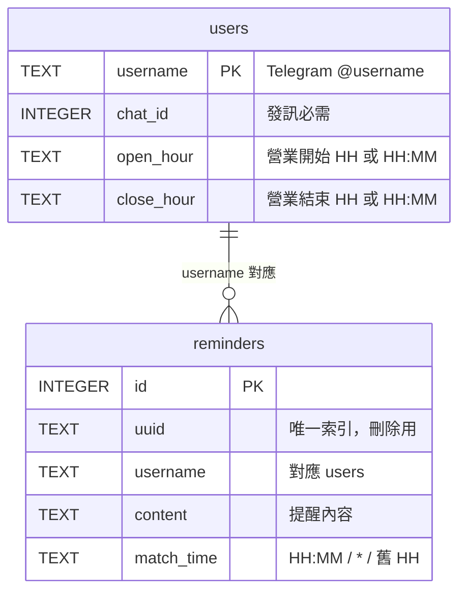
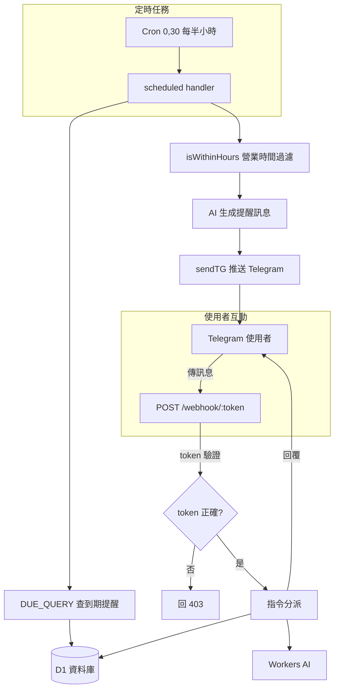
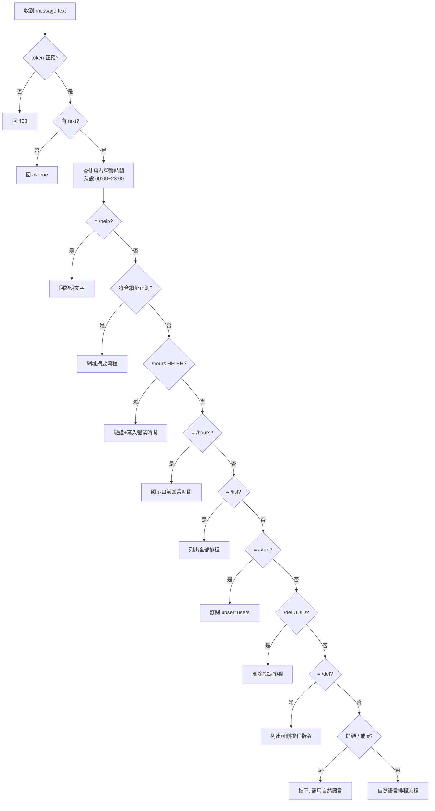
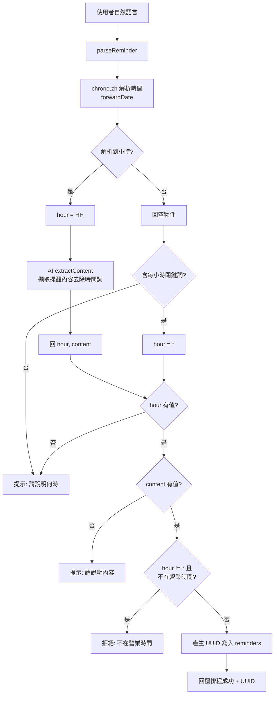
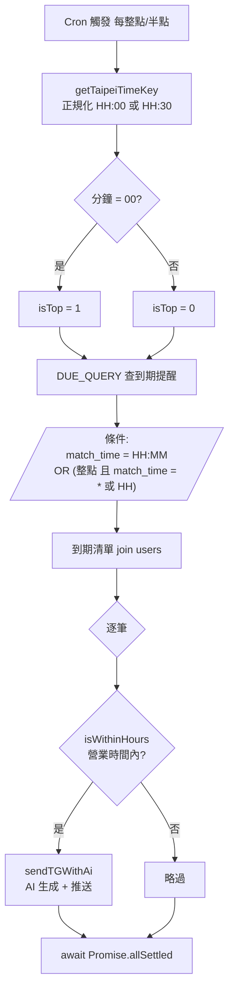
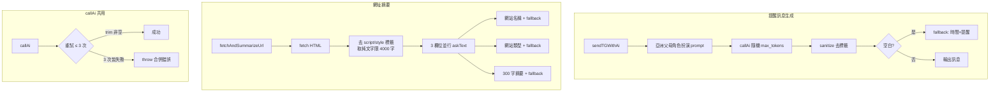

# Telegram 提醒機器人 — 業務邏輯與流程圖報告

> 研究日期：2026-06-27
> 範圍：`telegram-reminder/` 子目錄之 Cloudflare Workers 程式碼

---

## 1. 系統概觀

一個跑在 **Cloudflare Workers** 的 Telegram 提醒機器人，技術堆疊：

| 層 | 技術 |
|----|------|
| HTTP 路由 | Hono |
| 資料庫 | Cloudflare D1（`users`、`reminders`） |
| AI | Workers AI 純文字（`@cf/meta/llama-3.1-8b-instruct-fast`） |
| 排程 | Cron `0,30 * * * *`（每整點與半點） |
| 時間解析 | chrono-node（中文自然語言） |

核心職責兩條主線：

1. **指令處理（同步）**：使用者在 Telegram 傳訊 → `POST /webhook/:token` → 解析指令 → 即時回覆。
2. **定時推送（非同步）**：Cron 每半小時觸發 → 查到期提醒 → 營業時間過濾 → AI 生成「亞洲父母」語氣訊息 → 推送。

### 進入點

| 進入點 | 用途 |
|--------|------|
| `POST /webhook/:token` | Telegram 訊息回呼，所有使用者指令入口 |
| `scheduled`（Cron） | 定時掃描到期提醒並推送 |
| `GET /test/:token?hour=HH` | 手動測試推送（實際發 Telegram） |
| `GET /debug/:token?text=...` | 測試自然語言解析，不發訊 |

所有進入點都用 `TELEGRAM_WEBHOOK_TOKEN` 比對，不符回 **403**。

---

## 2. 資料模型

- `match_time` 三種形態：
  - **`HH:MM`**（精確，含半點 `HH:30`）→ 隨時觸發。
  - **`*`**（每小時）→ 僅整點觸發。
  - **舊 `HH`**（相容格式）→ 僅整點觸發。
- `open_hour` / `close_hour` 相同 = 24 小時營業。

---

## 3. 系統整體流程

---

## 4. Webhook 指令分派流程

訊息進入後依序比對，**先命中先回覆並 return**：

> 注意：`/hours`（純指令）與 `/del`（純指令）這兩段未在命中後 `return`，但其後的條件不會誤判，因為自然語言分支前有 `開頭 / 或 #` 的攔截。

---

## 5. 自然語言排程流程

最核心的業務：把「早上 9 點提醒我開會」轉成一筆排程。

重點：

- **時間**來自 chrono；**內容**來自一次純文字 AI 呼叫（`extractContent`）。
- 「每小時」關鍵詞（`每小時`/`every hour`/`/hourly` 等）由正則補判，設 `hour = "*"`。
- 營業時間限制只套用在具體小時的排程，`*`（每小時）不受限。

---

## 6. Cron 定時推送流程

設計要點：

- **半點防重複**：精確 `HH:30` 排程在半點觸發；`*` 與舊 `HH` 僅整點觸發，避免半點被重複推送。
- **必須 `await`**：cron 與 test 端點都用 `await Promise.allSettled`，不能用 `waitUntil`——回應送出後背景任務會被提早取消，導致訊息送不出去。
- 營業時間用 `isWithinHours` 二次過濾（支援跨夜 `20:00~05:30` 與 24 小時）。

---

## 7. AI 呼叫流程（純文字模式）

專案**已全面棄用 JSON Mode**，所有 AI 呼叫走純文字；多欄位需求拆成多次並行呼叫。

- **模型**：`@cf/meta/llama-3.1-8b-instruct-fast`（`ai-config.ts`）。
- **棄用 JSON Mode 原因**：`-fast` 模型回 `8007 Grammar error: Invalid type: json_schema`（文件謊報支援）；70b-fp8-fast 長輸出回 `5024 JSON Mode couldn't be met`。
- **韌性設計**：`callAi` 重試 3 次；每個 AI 欄位都有 `catch` fallback，部分失敗不影響其他欄位；空白回應有保底訊息（避免 Telegram 拒收空訊息）。

---

## 8. 指令一覽

| 指令 | 行為 |
|------|------|
| `/start` | 訂閱（upsert users）並顯示說明與營業時間 |
| `/help` | 顯示功能列表 |
| `/hours HH HH` | 設定營業時間（支援半點，如 `9:30 18:30`；開關相同 = 24h） |
| `/hours` | 顯示目前營業時間 |
| `/list` | 列出全部排程（含 UUID） |
| `/del <UUID>` | 刪除指定排程 |
| `/del` | 列出可刪排程的指令清單 |
| 貼上網址 | 回傳網站名稱、類型與約 300 字繁中摘要 |
| 自然語言 | 解析時間與內容後新增排程 |
| 其他 `/` `#` 開頭 | 擋下，提示改用自然語言 |

---

## 9. 關鍵設計與風險提醒

| 主題 | 說明 |
|------|------|
| 時間正規化 | 全系統僅支援整點與半點（分鐘 00/30），`normHalfTime` 嚴格驗證 |
| 半點防重複 | `*` 與舊 `HH` 僅整點觸發，是排程機制的核心 |
| Webhook token | 改 `TELEGRAM_WEBHOOK_TOKEN` 後**必須重註冊 webhook**，否則指令靜默 403（但 cron 仍推送，造成「提醒正常、指令無反應」假象） |
| 背景任務 | cron/test 必用 `await`，不可 `waitUntil`，否則訊息送不出 |
| 型別檢查 | 專案無安裝 TypeScript，靠 esbuild 打包；型別錯誤不擋部署，驗證用 `wrangler deploy --dry-run` |
| 部署陷阱 | 用 `wrangler deploy --minify`；`pnpm deploy`（無 `run`）是 pnpm 內建子命令會報錯 |

---

## 10. 結論

系統以 **Hono Webhook + Cron** 雙主線構成，資料落在 D1，AI 全程走純文字模式並具完整 fallback。業務邏輯清晰：指令分派採「先命中先回覆」的順序式比對，自然語言排程以 chrono（時間）+ AI（內容）拆解，定時推送透過 `DUE_QUERY` 的整點/半點旗標避免重複、再以營業時間二次過濾。最易踩雷的環節是 **webhook token 重註冊** 與 **背景任務必須 await**，兩者都已在 `CLAUDE.md` 與程式碼註解中明確標註。
