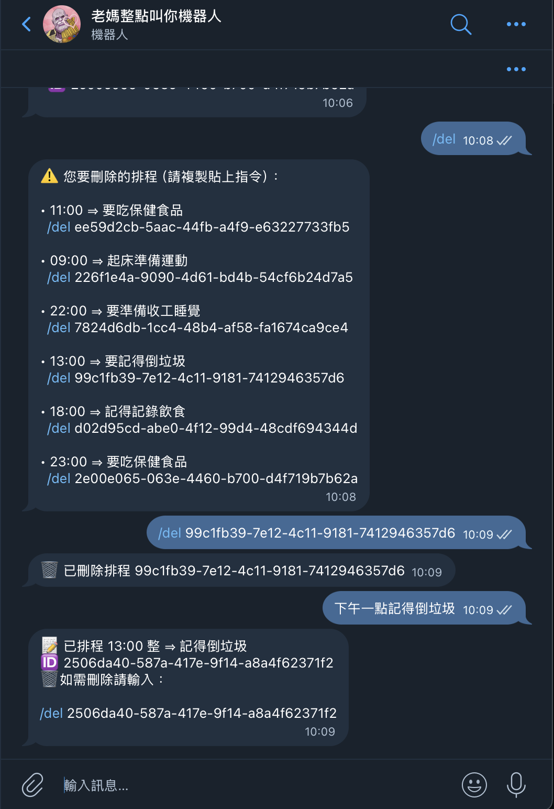

# 老媽整點叫你機器人

把 Telegram 變成你的私人鬧鐘／小管家，使用自然語言就能排「整點」或「每小時」的提醒，在指定整點的時候，使用老媽的口吻提醒你該注意的事項。後端完全跑在 Cloudflare Workers + D1，0 維護、即時推播。

⸻

## 目錄

1. 操作截圖說明
2. 功能總覽
3. 操作指令
4. 專案目錄結構
5. 架設步驟
6. AI 解析流程與風險
7. 技術棧
8. 感謝與鳴謝

⸻

## 操作截圖說明

以下為機器人操作流程與使用介面示意：

| 操作步驟                                  | 截圖                                                                        | 說明                                                                   |
| ----------------------------------------- | --------------------------------------------------------------------------- | ---------------------------------------------------------------------- |
| 啟動與說明 `/start` `/help`               | <a href="./幫助.png" target="_blank"></a> | 開啟提示與功能說明，包括 `/hours` 設定營業時間、自然語言指令示範等。   |
| 查看排程 `/list`                          | <a href="./列表.png" target="_blank"></a> | 查看目前所有提醒排程，包含時間、內容與唯一 ID。                        |
| 操作排程 `/del <UUID>` + 自然語言新增提醒 | <a href="./操作.png" target="_blank"></a> | 支援複製指令刪除特定排程，或直接輸入「下午一點記得倒垃圾」新增提醒。   |
| 整點提醒推播展示                          | <a href="./提醒.png" target="_blank"></a> | 在設定的整點，自動發送溫馨提醒訊息，例如：「該吃保健食品了，為你好」。 |

⸻

## 功能總覽

### 功能 說明

1. 自然語言排程 明天早上 8 點提醒我和小明開會
2. 每小時排程 每小時 提醒喝水（僅在營業時間內推播）
3. 營業時間 /hours 09 18 → 09:00–18:00 才提醒。兩個營業時間輸入相同內容則會 24 小時營業
4. 排程列表 /list 查看所有排程與 UUID
5. 刪除排程 /del <UUID>
6. 說明 /help / /start
7. 授權 License
8. 截圖 Screenshot

⸻

## 操作指令

/start － 訂閱並顯示說明
/help － 顯示說明
/hours HH HH － 設定營業時間
/list － 查看排程
/del － 查看全部刪除指令
/del <UUID> － 刪除排程
（自然語言） － 新增排程

⸻

將目錄結構包在 程式碼區塊 內即可保持排版：

## 專案目錄結構

```text
telegram-reminder/
├─ wrangler.jsonc         # Workers 設定檔，定義 Cron 時間、D1 資料庫、AI 模型
├─ init.sql               # D1 初始 schema，儲存提醒項目與排程狀態
├─ README.md              # 專案介紹與部署教學
├─ pnpm-lock.yaml         # 套件版本鎖定檔
├─ .gitignore             # Git 忽略清單
├─ src/                   # 主程式碼區
│  ├─ index.ts            # Worker 入口，處理 Router 與定時觸發
│  ├─ handler.ts          # 主要業務邏輯：訊息處理與提醒觸發
│  ├─ parseReminder.ts    # 自然語言時間解析（chrono + AI）
│  ├─ ai-config.ts        # 模型 ID、提示詞等 AI 設定
│  ├─ types.ts            # 全域型別定義（如 Reminder 資料型別）
│  └─ constants.ts        # 常數定義，如時區、訊息範本等
├─ utils/                 # 工具函式
│  ├─ scheduler.ts        # 排程相關邏輯（如 nextTrigger 計算）
│  ├─ logAction.ts        # 操作紀錄與統計更新
│  └─ chrono.ts           # 時間格式與跨日處理工具
├─ views/
│  └─ index.html          # 簡易前端頁面，顯示提醒 UI 或 debug 工具
```

若不使用 AI，可刪除 ai-config.ts 與 parseReminder.ts 中的 AI fallback。

⸻

## 架設步驟

1. 申請 Telegram Bot
   透過 @BotFather → /newbot → 拿到 Bot Token
2. 建立 Cloudflare Workers 專案

```bash
pnpm create hono telegram-reminder   # 選 cloudflare-workers
cd telegram-reminder
pnpm add hono chrono-node            # 必要依賴
pnpm add -D @cloudflare/workers-types
```

3. 初始化 D1

```bash
wrangler d1 create reminders
wrangler d1 execute reminders --file=./init.sql
```

4. 設定環境變數

- TELEGRAM_BOT_TOKEN 為 Telegarm @BotFather 提供，建立機器人與取得 token 教學：[點我](https://tcsky.cc/tips-01-telegram-chatbot/)

- TELEGRAM_WEBHOOK_TOKEN 為專案密鑰，請自行產生

```bash
#產生 TELEGRAM_WEBHOOK_TOKEN
uuidgen
# 範例：6F9619FF-8B86-D011-B42D-00C04FC964FF

wrangler secret put TELEGRAM_BOT_TOKEN
wrangler secret put TELEGRAM_WEBHOOK_TOKEN
```

5. （可選）啟用 AI

- wrangler.jsonc 新增

```bash
"ai": { "binding": "AI" }
```

- 安裝 @cloudflare/ai，並在 parseReminder() 內引入 env.AI
- 建議安裝起來，如果不想使用直接把 parseReminder.ts 中 AI 片段註解即可

```bash
# 抓這段 function 註解起來
/* ---------- 2) fallback：Workers AI LLM ---------- */
	const
  ...
  ...
  console.log("AI Response error:", _.message); // Debug: Log the AI response
}
```

- 替換 AI 模型於 src/ai-config.ts 中調整。
- Cloudflare Workers AI LLM Playground：[點我](https://playground.ai.cloudflare.com/)
- 列表所有可用 AI 模型請輸入指令：

```bash
wrangler ai models
```

6. 部署

```bash
wrangler deploy
```

7. 綁定 Webhook

```bash
curl "https://api.telegram.org/bot$TELEGRAM_BOT_TOKEN/setWebhook" \
  -d "url=https://<WORKER_URL>/webhook/$TELEGRAM_WEBHOOK_TOKEN"
```

8. 完成！ 在 Telegram 輸入 /start 測試。

---

## 測試 API 使用方法

| API                                  | 用途                                                                                 | 範例                                                                                       |
| ------------------------------------ | ------------------------------------------------------------------------------------ | ------------------------------------------------------------------------------------------ |
| **`GET /test/:token?hour=HH`**       | 立即觸發指定小時（或目前台灣小時）的推播，驗證 Cron 流程與訊息格式。                 | `bash\ncurl "https://<WORKER_URL>/test/$TELEGRAM_WEBHOOK_TOKEN?hour=15"\n`                 |
| **`GET /debug/:token?text=<query>`** | 走一次 `parseReminder()` 流程（chrono → AI Fallback），回傳解析結果 JSON，便於除錯。 | `bash\ncurl "https://<WORKER_URL>/debug/$TELEGRAM_WEBHOOK_TOKEN?text=早上8點提醒我開會"\n` |

> - 兩條路由皆使用 **`TELEGRAM_WEBHOOK_TOKEN`** 做權限保護，避免被隨意呼叫。
> - `/test` 若省略 `hour` 參數，則以「台灣當前小時」為基準推播。
> - `/debug` 會回傳如 `{ "input": "...", "parsed": { "hour": "08", "content": "開會" } }` 的 JSON 供檢查。

部屬後建議僅在開發階段開放此兩條 API；確認正常後可移除或以 Workers 角色權限限制存取。

---

## AI 解析流程與風險

1. 先跑 chrono-node —— 零成本、確認解析時間是否成功
2. 如果失敗則返回錯誤提示，成功的話呼叫 Workers AI（模型可自選）判斷擷取提醒內容。
3. 可能錯誤，錯誤則返回提示：

- AI 生成 使用 JSON MODE → 程式將回傳「缺少時間 / 內容」提示。
- 時區詞彙過於模糊（例：晚點） → 解析成預設值或提示重試 4. 關閉 AI。
- 刪除 wrangler.jsonc 中 "ai" 區塊。

⸻

## 技術棧

| 類別         | 技術                                         |
| ------------ | -------------------------------------------- |
| 執行環境     | Cloudflare Workers                           |
| 資料庫       | Cloudflare D1 (SQLite)                       |
| 排程         | Workers Cron Triggers                        |
| Web 框架     | Hono                                         |
| 自然語言解析 | chrono-node                                  |
| AI（可選）   | Cloudflare Workers AI ＋ Qwen-0.5B（可替換） |
| 依賴管理     | pnpm                                         |
| 語言         | TypeScript                                   |

---

---

## 授權 License

本專案採用 **MIT License** 釋出，詳見 [`LICENSE`](./LICENSE)。

---

## 感謝與鳴謝

- 感謝 Cloudflare 提供 Workers / D1 / AI 等無伺服器服務
- 感謝 Telegram 團隊提供方便的 Bot API
- 感謝所有開源作者（Hono、chrono-node、pnpm…）的努力
- 若本專案對你有幫助，歡迎 🌟 star、fork 或提 PR！

---
